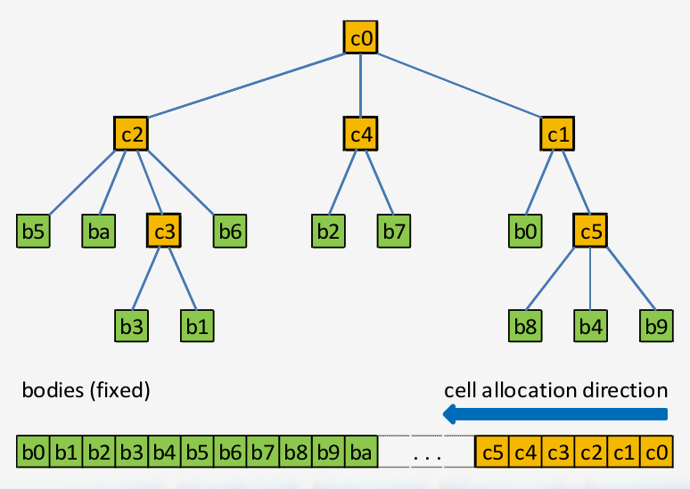

# Quad Tree Builder and Filter

The Quad Tree Builder and Filter allow one to filter 2D data relative to a response value
in a spatially aware manner. For example, if one has D data and desires to find Q data with
high response values - Q < D - instead of selecting the Q data with the highest responses
using the Quad Tree Filter, you can choose the Q data with high response values that are
distributed across the entire bounded 2D plane. This is very useful when selecting features
for camera-based SLAM systems.

This code was written and validated under the following conditions:

* a linux machine running Ubuntu 16.04.1
* gnu 4.9.4
* CUDA 8.0

**NOTES**:

* The exact structure of the QuadTree is dependent upon the order in which the data are entered
* Given the variable scheduling on GPUS, the same dataset can result in slightly differenct QuadTrees across runs

## Compiling

```console
make clean && make -j6
```

## Resources

**Efficient-CUDA-Implementation-of-Tree-Based-N-Body-Algorithm**

<http://on-demand.gputechconf.com/gtc/2012/presentations/S0111-Efficient-CUDA-Implementation-of-Tree-Based-N-Body-Algorithm.pdf>

**CUDA Example Implementation**

<https://github.com/jlong29/Nbody-Barnes-Hut-CUDA>

**OpenCL Example Implementation**

<https://github.com/jlong29/gpu-nbody>

## Efficient-CUDA-Implementation-of-Tree-Based-N-Body-Algorithm

**The Problem**

**Regular Codes**: control flow is a predictable function of input size

* e.g. Matrix Multiplication

**Irregular Codes**: control flow is an unpredictable function of input values

* e.g. Trees

### Tree Structure and Representation

**CELLS** are in internal nodes in the tree
**BODIES** are leafs



The Tree is stored in a single array

* For N bodies, the bodies are stored from 0...N-1
* The cells are stored from N...Max Nodes
	* There is no reason you cannot start allocating cells at N
